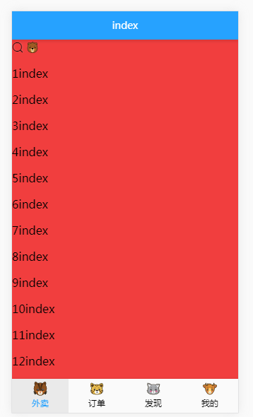

## 基于vue的移动端快速开发
webpack2版本在webpack2分支   
0.基于vue-cli 免去一些重复劳作    
1.加入启动自动以本机ip启动，方便移动端调试   
2.对axios进行简单封装,可以拦截,取消请求,请求统一管理   
3.自动安装常用依赖axios,js-cookie,less,sass,stylus,...     
4.打包后查看资源大小仪表图by `webpack-bundle-analyzer`    
```
npm run dist
```
5.资源仪表图by`webpack-jarvis`
```
localhost:1337
```
6.自带简单路由动画    
7.自带vuex和路由模板   
8.自带基础布局    
9.主要依赖 默认cnd引入 不打包进vendor     
10.自定义图标字体 支持iconfont和symbol(多色图表)
11.babel-polyfill     
12.默认压缩首页css和js     
13.首屏loading


## Build Setup

``` bash
# 安装依赖
npm install

# 以本机ip启动 方便移动端调试（连接局域网vpn时有时候无效）
npm run dev

# 打包
npm run build

# 打包并分析构建
npm run dist

# 单元测试
npm run unit

# e2e测试
npm run e2e
```

